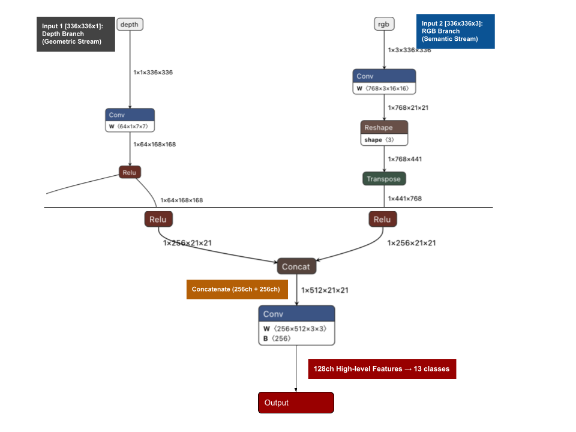
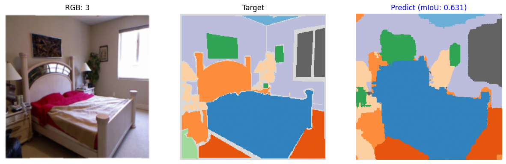

# RGB-D Semantic Segmentation with CLIP-ViT and Depth U-Net Late Fusion
**Multimodal RGB-D Semantic Segmentation using CLIP-ViT and Depth U-Net with Late Fusion**

> Language: Japanese Only
> 本リポジトリのドキュメントは日本語のみで記述されています。
> 
> データセットに関するお知らせ
>
> 本プロジェクトでは、深層学修コミュニティの最終課題で使用されたデータセットを利用しています。
> コミュニティのルールにより、このリポジトリでは当該データセットを再配布しておりません。
>
> 同様の実験を再現する際には、NYUv2などの公開されているRGB-Dデータセットをご利用ください。
>
> Dataset Notice
>
> This project uses a dataset from a course final assignment.
> Due to community rules, the dataset is not redistributed in this repository.
>
> Please use publicly available RGB-D datasets such as NYUv2 to reproduce similar experiments.

## Project Overview

本プロジェクトでは、NYUv2を用いてRGB-D屋内シーン向けのマルチモーダルセマンティックセグメンテーションモデルを実装しています。

このアーキテクチャは、以下の要素を組み合わせています：

- セマンティック表現のためのCLIP ViT-Base
- 幾何学的特徴量のための深度ベースのU-Netエンコーダー
- マルチモーダル統合のためのLate Fusion

本実装は、PyTorch MPSアクセラレーションを活用し、Apple Silicon（M1/M2/M3）向けに最適化されています。

## 課題・目的

> NYUv2（New York University Depth Dataset v2）は、RGB画像と深度画像のペアからなる室内シーンの意味的セグメンテーションデータセットです。13クラスのアノテーションが提供されており、本プロジェクトでは深度情報を組み合わせることで、室内の空間的構造を考慮した高精度なセグメンテーションを実現することを目的としています。
> 

## 特徴

一般的なApple Silicon (M1/M2/M3) 環境において、セマンティックセグメンテーション（NYUv2）を快適に動作させることを目的としたアーキテクチャを採用しています。

1. **Late Fusion Architecture:** `CLIP-ViT-Base` によるグローバルな特徴解析・広範囲の意味抽出と、`U-Net` (ResNet backbone) による深度画像からのエッジ（幾何学的）復元を統合。
2. **M1/MPS Optimized:** Apple Silicon の Unified Memory を最大限活用し、メモリ効率を考慮した設計（中間層128チャネル）。
3. **Hybrid Loss:** クラス不均衡に頑健に対応するため、Focal Loss + Dice Loss のハイブリッド関数を実装。
4. **Modular Design:** `SegSetup` および `PrepareDatasets` クラスによる、疎結合でメンテナンス性の高いコードベース。

## Dataset

NYU Depth Dataset V2 (NYUv2)

https://cs.nyu.edu/~silberman/datasets/nyu_depth_v2.html

## Model Architecture

> 
> Figure 1: Late Fusion Model アーキテクチャ. 
> 本モデルは幾何ストリーム（入力1： $336 \times 336 \times 1: \text{Depth}$ ）と意味的ストリーム（入力2:　$336 \times 336 \times 3: RGB$　）を統合する構成となっている。
> 特徴量の抽出には、それぞれResNet-18ベースのエンコーダ と 学習済みViT（Vision Transformer） を使用している。
> 両ストリームから抽出された特徴量（ $21 \times 21$　）は、結合レイヤー（512チャネル）で統合される前に、同一の解像度へアップサンプリングされる。最終的な出力層では、128チャネルの高次元特徴表現を用いることで、全13クラスに対するセマンティックセグメンテーションを提供する。
> 本図は入力解像度336×336時のアーキテクチャを示す。最終的な訓練では448×448を採用した。

## Results
### Quantitative Results

| Model | mIoU | Notes |
|------|------|------|
| DeepLabV3+ | 0.532 | Baseline |
| Proposed Late Fusion | **0.6144** | CLIP-ViT + Depth U-Net |

### Qualitative Results



### Project Report (PDF)

トレーニング曲線、クラスごとのIoU分析、実験ログを含む完全な技術レポートは、以下からご覧いただけます。
The complete technical report, including training curves, IoU analysis by class, and experiment logs, is available here.(Japanese Only)

[NYUv2 Late Fusion Technical Report](docs/pdf/NYUv2SemanticSegmentationCLIP-ViT+LateFusionImplementationonAppleM1.pdf)

## 開発環境の構築

本プロジェクトは `src` ディレクトリ構造を採用しています。
開発やテストを行う際は、以下の手順で Python の仮想環境（`.venv`）を構築し、パッケージをインストールしてください。

### 1. 仮想環境の作成と有効化

プロジェクトのルートディレクトリで以下のコマンドを実行し仮想環境を作成します。

```bash
# 仮想環境の作成
python3 -m venv .venv
# 仮想環境の有効化
source .venv/bin/activate
```

### 2. パッケージのインストール
```
# pip自体のアップデート（推奨）
pip install --upgrade pip

# 依存ライブラリのインストール
pip install -r requirements.txt

# プロジェクトを開発用（エディタブルモード）でインストール
pip install -e .
```

> Note: pip install -e . を実行することで、`src/`内のコードを変更した際に、再インストールなしで反映されるようになります。


### 3. 仮想環境の終了
```
deactivate
```

## Training Configuration (訓練設定)
- **Input Resolution:** 448 × 448
- **Batch Size:** 8
- **Epochs:** 10
- **Optimizer:** AdamW
- **Base Learning Rate:** 1e-4

### Learning Rate Strategy
> 異なるモジュールに対して異なる学習率を設定した。
> CLIP (ViT) エンコーダは事前学習済みモデルであるため、過度な重み更新を防ぐ目的で小さい学習率を設定した。
> 一方、Depth U-Net はスクラッチ学習に近いため、より大きな学習率を使用している。
- **CLIP Encoder:** Base LR × 1e-2  
- **U-Net Encoder:** Base LR × 3.0  
- **Late Fusion / Decoder:** Base LR × 1.0

## 実行

	データセットが所定のディレクトリ(datasets/nyuv2/)以下に正しく配置されていることを確認し、以下のコマンドで前処理を実行してから学習を開始します。

### 前処理の実行
```
python3 preprocess.py
```

### データセット配置イメージ
```
datasets/
└── nyuv2/
    ├── train/
    │   ├── image/
    │   ├── depth/
    │   └── label/
    └── test/
```

### 前処理実行後
```
datasets/
└── nyuv2/
    ├── train/
    │   ├── image/
    │   ├── depth/
    │   ├── label/
    │   ├── numpy/
    │   └── mask/
```

### 学習開始（初期学習の場合、train.py内のis_load_modelをFalseにすること）
```
python3 train.py
```

## References
[1] Chen, J., et al. (2021). "TransU-Net: Transformers Make Strong Encoders for Medical Image Segmentation." arXiv preprint arXiv:2102.04306.  
[2] Ranftl, R., et al. (2021). "Vision Transformers for Dense Prediction." Proceedings of the IEEE/CVF International Conference on Computer Vision (ICCV), pp. 12179-12188.  
[3] Radford, A., et al. (2021). "Learning Transferable Visual Models from Natural Language Supervision." International Conference on Machine Learning (ICML), PMLR 139:8748-8763.  
[4] Silberman, N., et al. (2012). "Indoor Segmentation and Support Inference from RGBD Images." European Conference on Computer Vision (ECCV), Springer, Berlin, Heidelberg, pp. 746-760.  
[5] Chen, L. C., et al. (2018). "Encoder-Decoder with Atrous Separable Convolution for Semantic Segmentation." Proceedings of the European Conference on Computer Vision (ECCV), pp. 801-818.
[6] Lin, T. Y., et al. (2017). "Focal Loss for Dense Object Detection." Proceedings of the IEEE International Conference on Computer Vision (ICCV), pp. 2980-2988.  
[7] Hazirbas, C., et al. (2016). "FuseNet: Incorporating Depth into Semantic Segmentation via Fusion-based CNN Architecture." Asian Conference on Computer Vision (ACCV), Springer, Cham, pp. 213-228.  
[8] PyTorch Documentation. "Introducing Accelerated PyTorch Training on Mac." PyTorch Blog (2022). Available at: https://pytorch.org/blog/introducing-accelerated-pytorch-training-on-mac/ (Accessed: 2026-03-10).
[9] Ronneberger, O., Fischer, P., & Brox, T. (2015). U-Net: Convolutional Networks for Biomedical Image Segmentation.  
Proceedings of the International Conference on Medical Image Computing and Computer-Assisted Intervention (MICCAI), 2015. arXiv preprint arXiv:1505.04597.  
[10] Gupta, S., Girshick, R., Arbelaez, P., & Malik, J. (2014). Learning Rich Features from RGB-D Images for Object Detection and Segmentation. Proceedings of the European Conference on Computer Vision (ECCV), 2014. arXiv preprint arXiv:1407.5736.  
  
Reproducibility: Code and training scripts will be released on GitHub to ensure reproducibility.

--- 

### 免責事項
> * 研究・教育用。シンプルさと高速な動作を実現するため、入力チェックは最低限の実装となっています。
> * Designed for research and education. Minimal input validation is performed for simplicity and performance.
> * ※ 本プロジェクトは個人開発ポートフォリオとして実装したものである。
> * ※ 本プロジェクトでは講座の最終課題で使用されたデータセットを実験用に流用しているが、コミュニティ規約によりデータセット自体は公開対象としない。そのため完全な再現は難しい可能性があるが、実験設定・モデル構成・学習条件については本レポート内で可能な限り詳細に記述した。
> * ※ 本プロジェクトでは、13クラスのインデックスを特定環境の独自の順序を仮定し（0: bed, ..., 11: wall 等）定義している。標準的な NYUv2 13-class順序と異なる場合があるため注意が必要である。
> * NYUv2 ラベル（1〜894）を評価に使用する際は、学習時のインデックスと同期させる必要がある。