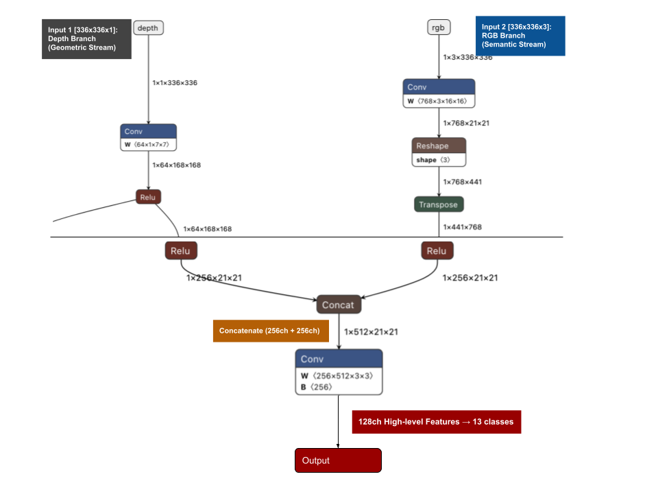
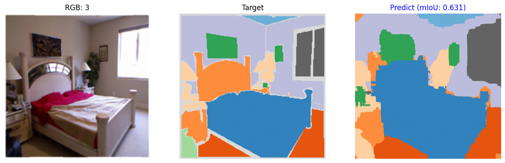

# Accessible RGB-D Semantic Segmentation: CLIP-ViT Late Fusion Implementation on Consumer-Grade Apple M1
**Multimodal RGB-D Semantic Segmentation using CLIP-ViT and Depth U-Net with Late Fusion**

> Language: Japanese Only
> 本リポジトリのドキュメントは日本語のみで記述されています。
> 
> データセットに関するお知らせ
>
> 本プロジェクトでは個人ポートフォリオ作成のためプライベートな学習プログラムで提供されたデータセットを利用していました。
> 規約に基づき、当該データセットは本リポジトリに含まれておりません。
> ** 再現性について: **
> 実験の再現方法（公開データセット NYUv2 の使用手順）については、[Quick Start & Reproducibility](#reproduce) を参照してください。
>
> Dataset Notice
>
> This project was developed for a personal portfolio using a dataset provided through a private study program.
> To reproduce the experiments, please use publicly available RGB-D datasets such as NYUv2.

## Project Overview

本プロジェクトでは、NYUv2を用いてRGB-D屋内シーン向けのマルチモーダルセマンティックセグメンテーションモデルを実装しています。

このアーキテクチャは、以下の要素を組み合わせています：

- セマンティック表現のためのCLIP ViT-Base
- 幾何学的特徴量のための深度ベースのU-Netエンコーダー
- マルチモーダル統合のためのLate Fusion

本実装は、PyTorch MPSアクセラレーションを活用し、Apple Silicon（M1/M2/M3）向けに最適化されています。

## 課題・目的

> NYUv2（New York University Depth Dataset v2）は、RGB画像と深度画像のペアからなる室内シーンの意味的セグメンテーションデータセットです。13クラスのアノテーションが提供されており、本プロジェクトでは深度情報を組み合わせることで、室内の空間的構造を考慮した高精度なセグメンテーションを実現することを目的としています。
> 

## 特徴

一般的なApple Silicon (M1/M2/M3) 環境において、セマンティックセグメンテーション（NYUv2）を快適に動作させることを目的としたアーキテクチャを採用しています。

1. **Late Fusion Architecture:** `CLIP-ViT-Base` によるグローバルな特徴解析・広範囲の意味抽出と、`U-Net` (ResNet backbone) による深度画像からのエッジ（幾何学的）復元を統合。
2. **M1/MPS Optimized:** Apple Silicon の Unified Memory を最大限活用し、メモリ効率を考慮した設計（中間層128チャネル）。
3. **Hybrid Loss:** クラス不均衡に頑健に対応するため、Focal Loss + Dice Loss のハイブリッド関数を実装。

## Dataset

[NYU Depth Dataset V2 (NYUv2)]

https://cs.nyu.edu/~silberman/datasets/nyu_depth_v2.html

[NYUv2 Meta Data]

https://github.com/ankurhanda/nyuv2-meta-data

## Model Architecture

> 
> Figure 1: Late Fusion Model アーキテクチャ.  
> 本モデルは幾何ストリーム（入力1： $336 \times 336 \times 1: \text{Depth}$ ）と意味的ストリーム（入力2: $336 \times 336 \times 3: \text{RGB}$　）を統合する構成となっている。  
> 特徴量の抽出には、それぞれResNet-18ベースのエンコーダ と 学習済みViT（Vision Transformer） を使用している。
> 両ストリームから抽出された特徴量（ $21 \times 21$　）は、結合レイヤー（512チャネル）で統合される前に、同一の解像度へアップサンプリングされる。最終的な出力層では、128チャネルの高次元特徴表現を用いることで、全13クラスに対するセマンティックセグメンテーションを提供する。  
> 本図は入力解像度336×336時のアーキテクチャを示す。最終的な訓練では448×448を採用した。

## Performance (Inference Speed)

Apple M1 GPU (MPS) 環境における推論速度の計測結果です。

| Input Resolution | Avg Inference Time | Throughput |
|:---|:---|:---|
| 224 × 224 (Estimated) | 63.55 ms | 15.74 FPS |
| 448 × 448 (Training) | 246.09 ms | 4.06 FPS |

> Note: `benchmark.py` を使用して、10回のウォームアップ後に平均測定。`torch.mps.synchronize()` により演算時間を算出しています。

## Results

### Quantitative Results

| Model | mIoU | Notes | 
|------|------|------| 
| DeepLabV3+ | 0.532 | Baseline |
| Proposed Late Fusion | **0.6144** | CLIP-ViT + Depth U-Net |

### Qualitative Results



### Project Report (PDF)

トレーニング曲線、クラスごとのIoU分析、実験ログを含む詳細な技術レポートは、Docswellにて公開しています。  
The detailed technical report, including training curves, per-class IoU analysis, and experiment logs, is available on Docswell.

## 開発環境の構築

本プロジェクトは `src` ディレクトリ構造を採用しています。  
開発やテストを行う際は、以下の手順で Python の仮想環境（`.venv`）を構築し、パッケージをインストールしてください。

### 1. 仮想環境の作成と有効化

プロジェクトのルートディレクトリで以下のコマンドを実行し仮想環境を作成します。

```bash
# 仮想環境の作成
python3 -m venv .venv
# 仮想環境の有効化
source .venv/bin/activate
```

### 2. パッケージのインストール
```
# pip自体のアップデート（推奨）
pip install --upgrade pip

# プロジェクトを開発用（エディタブルモード）でインストール
pip install -e .
```

> Note: pip install -e . を実行することで、`src/`内のコードを変更した際に、再インストールなしで反映されるようになります。


### 3. 仮想環境の終了
```
deactivate
```

## Training Configuration (訓練設定)
- **Input Resolution:** 448 × 448
- **Batch Size:** 8
- **Epochs:** 10
- **Optimizer:** AdamW
- **Base Learning Rate:** 1e-4

### Learning Rate Strategy (差分学習率)

> モジュールごとの特性に合わせ、最適化の感度を調整しています。

| Module | LR Multiplier | Reason |
|:---|:---|:---|
| CLIP Encoder | Base LR × 0.01 | 事前学習済みの重みを壊さないよう微調整 |
| U-Net Encoder | Base LR × 3.0 | 幾何学的特徴の抽出を加速させるため高めに設定 |
| Late Fusion / Decoder | Base LR × 1.0 | 統合層の標準的な学習 |

## <a id="reproduce"></a>Quick Start & Reproducibility

	データセットが所定のディレクトリ(datasets/nyuv2/)以下に正しく配置されていることを確認してください。
    以下のコマンドでは、前処理を実行してから学習を開始します。  
  
### 前処理の実行
データセットの準備から学習まで、以下の手順で実行可能です。

### 1. 準備
約2.8GBのデータをダウンロードし、訓練用フォーマット（13クラス）に変換します。
※ 初回実行時に約2.8GBのデータをダウンロードします。サーバー負荷を考慮し複数回の実行はお控えください。

```bash
# nyuv2/label data処理を実行
# 以下のShellスクリプトで自動的に訓練・評価データをダウンロード・ラベル付与しています。

# 1. データセットの準備 (約2.8GBのダウンロードと13ラベル変換)
chmod +x prepare.sh
sh prepare.sh
```

### 2. 実行：学習（初期学習の場合、src/config.py内のIS_LOAD_MODELをFalseにします。）
```bash
python3 train.py
```

### 3. 実行：評価・ベンチマーク(Reproducibility Guide)
学習済みモデルの再現性とパフォーマンスを検証するためのスクリプトを用意しています。

- 精度検証 (mIoU/クラス別IoU):
```bash
python3 test/pipeline.py
```

- 推論速度計測 (FPS):
```bash
python3 test/benchmark.py
```
--- 
補足：データは連番です。コンペティションなどデータリークを厳しく管理する場合は別のクレンジング方法を使用してください。

### データセット配置イメージ
```
datasets/
└── nyuv2/
    ├── train/
    │   ├── image/
    │   ├── depth/
    │   └── label/
    └── test/
```

### 前処理実行後
```
datasets/nyuv2/
├── train/
│   ├── image/ , depth/ , label/  (Raw Data)
│   ├── * numpy/ *                (Converted .npy files for training)
│   └── * mask/  *                (Mapped 13-class labels)
└── test/
    └── ... (Same structure as train)
```


## References
[1] Chen, J., et al. (2021). "TransU-Net: Transformers Make Strong Encoders for Medical Image Segmentation." arXiv preprint arXiv:2102.04306.  
[2] Ranftl, R., et al. (2021). "Vision Transformers for Dense Prediction." Proceedings of the IEEE/CVF International Conference on Computer Vision (ICCV), pp. 12179-12188.  
[3] Radford, A., et al. (2021). "Learning Transferable Visual Models from Natural Language Supervision." International Conference on Machine Learning (ICML), PMLR 139:8748-8763.  
[4] Silberman, N., et al. (2012). "Indoor Segmentation and Support Inference from RGBD Images." European Conference on Computer Vision (ECCV), Springer, Berlin, Heidelberg, pp. 746-760.  
[5] Chen, L. C., et al. (2018). "Encoder-Decoder with Atrous Separable Convolution for Semantic Segmentation." Proceedings of the European Conference on Computer Vision (ECCV), pp. 801-818.
[6] Lin, T. Y., et al. (2017). "Focal Loss for Dense Object Detection." Proceedings of the IEEE International Conference on Computer Vision (ICCV), pp. 2980-2988.  
[7] Hazirbas, C., et al. (2016). "FuseNet: Incorporating Depth into Semantic Segmentation via Fusion-based CNN Architecture." Asian Conference on Computer Vision (ACCV), Springer, Cham, pp. 213-228.  
[8] PyTorch Documentation. "Introducing Accelerated PyTorch Training on Mac." PyTorch Blog (2022). Available at: https://pytorch.org/blog/introducing-accelerated-pytorch-training-on-mac/ (Accessed: 2026-03-10).
[9] Ronneberger, O., Fischer, P., & Brox, T. (2015). U-Net: Convolutional Networks for Biomedical Image Segmentation.  
Proceedings of the International Conference on Medical Image Computing and Computer-Assisted Intervention (MICCAI), 2015. arXiv preprint arXiv:1505.04597.  
[10] Gupta, S., Girshick, R., Arbelaez, P., & Malik, J. (2014). Learning Rich Features from RGB-D Images for Object Detection and Segmentation. Proceedings of the European Conference on Computer Vision (ECCV), 2014. arXiv preprint arXiv:1407.5736.  
  
Reproducibility: Code and training scripts will be released on GitHub to ensure reproducibility.

--- 

### 免責事項
> * 研究・教育用。シンプルさと高速な動作を実現するため、入力チェックは最低限の実装となっています。
> * Designed for research and education. Minimal input validation is performed for simplicity and performance.
> * ※ 本プロジェクトは個人開発ポートフォリオとして実装したものです。
> * ※ 本プロジェクトでは、13クラスのインデックスを特定環境の独自の順序を仮定し（0: bed, ..., 11: wall 等）定義している。標準的な NYUv2 13-class順序と異なる場合があるため注意が必要である。
> * NYUv2 ラベル（1〜894）を評価に使用する際は、学習時のインデックスと同期させる必要がある。